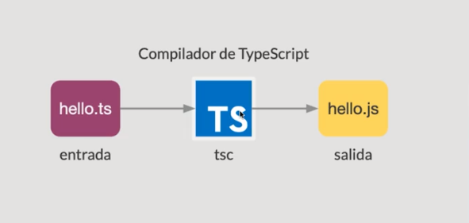

# Notas - Curso de Fundamentos de TypeScript

# **Que es typescript?**

Superset de Js, agrega funcionalidades a javascript y lo compila para que sea ejecutado en cualquier medio.

-   Lenguaje de programacion Tipado
-   Alto nivel
-   Genera como resultado codigo Js

## Otras caracteristicas:

-   Es de codigo abierto
-   Se puede desarrollar en cualquier sistema operativo
-   el codigo se puede ejecutar en cualquier navegador o plataforma

Todo el codigo en Vanilla Js es valido en un archivo de tipo TS por lo tanto es facilmente implementable en proyectos que ya esten avanzados

## Porque usar typescript

-   Programacion Orientada a Objetos
-   Potencia el codigo Js
-   Mayor productividad
-   Sistema de tipos
-   Complia todas las versiones de Js
-   Proyecto activo open source
-   Comunidad grande
-   Evitar bugs prevenibles

## Que empresas utilizan TypeScript

-   Microsoft
-   Google
-   Airbnb
-   Shopify
-   Slack
-   Medium

# Instalación y funcionamiento del compilador de TypeScript

Instalamos globalmente:

```bash
npm install -g typescript
```

El rol del compilador tsc es transformar nuestro codigo escrito en Ts a plano Js para que pueda ser interpretado por los navegadores y otras plataformas



### Como compilar un archivo Ts

```bash
// compilamos el archivo ts
tsc hello.ts

// ejecutamos el nuevo archivo creado por el compilador
node hello.js
```

### Compilamos de manera automatica un archivo en particular

este se va a compilar cada vez que haya un cambio en el archivo en cuestion

```bash
tscc --watch hello.ts
```

# Configurar Typescript

`tsconfig.json`

-   Especifica la raiz de un proyecto TS
-   Permite configurar opciones para el compilador

Para crear este archivo en cualquier proyecto:

```bash
tsc --init
```

El archivo base es este:

```json
{
	"extends": "./config/base"
	"compilerOptions":{
		"target": "es6",
		"module": "commonjs"
		"strict": true,
		"removeComments": true
	},
	"include":[
		"src/**/*.ts"
	],
	"exclude": [
		"node_modules",
		"**/*.test.ts"
	]
}
```

Una vez que este archivo es generado, ejecutamos:

```json
tsc // Busa la configuracion dentro del proyecto
tsc --project platzi // Especifica el directorio donde esta la configuracion
tsc file.ts // Omite la configuracion
```

Para ver todas las configuraciones que podemos hacer:

[TSConfig Reference - Docs on every TSConfig option](https://www.typescriptlang.org/tsconfig)

# Tipado en TS

### Explicito

Define una sintaxis para la creacion de variables con tipo de dato, a la hora de declarar la varibale asignamos un tipo de dato fijo

La sintaxis es la siguiente:

```tsx
name: string;
```

### Inferido

TS tiene la habilidad de deducir el tipo en funcion de un valor
La sintaxis es la siguiente:

```tsx
//Ts asume que al asignarle un string el tipo de dato va a ser siempre Strings
name = 'Federico';
```

## Tipos en TS

-   Number
    Valores numericos, hexadecimales, binarios, octales
    **Sintaxis:**

    ```tsx
    //Explicito
    let phone: number;

    //Inferido
    let phoneNumber = 523421;

    //hex
    let hex: number = 0xf00d33;

    //binary
    let binary: number = 0b1010;
    ```

-   Boolean
    Solo se pueden asignar `true` y `false`
    **Sintaxis:**

    ```tsx
    //Explicito
    let isLegalAge: boolean;

    //Inferido
    let isLegalAge: true;
    ```

-   String
    **Sintaxis:**

    ```tsx
    //Explicito
    let userName: string = 'Federico';

    //Inferido
    let userName = 'Federico';
    ```

-   Array
    Conjunto de datos
    **Sintaxis:**

    ```tsx
    // []
    // Explicito
    let users: string[] = ['federico', 'ramiro', 'juaquin'];

    // Inferido
    let users = ['federico', 'ramiro', 'juaquin'];

    //Array<TIPO>
    let users: Array<string> = ['federico', 'ramiro', 'juaquin'];
    ```

-   Tuple
    Es un array con un numero de elementos disponibles fijos, ademas de declarar tambien cual sera el tipo de valores que va a contener en cada elemento
    Cada elemento deberia tener un tipo distinto, es decir no deberias declarar una tupla con dos string por ejemplo
    **Sintaxis**
    ```tsx
    // [1, 'user']
    let user: [number, string];
    user = [1, 'fedewalo'];
    ```
-   Enum
    Definen un conjunto de valores contantes con nombre
    **Sintaxis:**

    ```tsx
    // Por default los valores que tendra este enum son 1,2,3 y 4
    enum PhotoOrientation {
    	Landscape,
    	Portrairt,
    	Square,
    	Panorama,
    }

    const landscape: PhotoOrientation = PhotoOrientation.Landscape;

    //Tambien podemos usar el enum con otros valores personalizados
    enum Country {
    	Bolivia = 'bol',
    	Colombia = 'col',
    	Mexico = 'mex',
    }

    const country: Country = Country.Colombia;
    ```

-   Any

    -   Usado para capturar valores dinamicos, Ts no checkea su tipado
    -   Los valores cambian de tipo en el tiempo - API's externas - Librerias de terceros
        Intentar no utilizarla ya que podria traer problemas o errores
        **Sintaxis:**

    ```tsx
    //Explicito
    let idUser: any = 1;
    udUser = 'as23d'; //no lanzaria error

    //Inferido
    let idUser;
    ```

-   Void
    -   Void es lo opuesto a any
    -   comunmente utilizado para declarar funciones que no necesitan retornar ningun valor
        sintaxis:
    ```tsx
    function showInfo(user: any): void {
    	console.log(user);
    }
    ```
-   Null

    -   Null es la no existencia de la variable
        Null es un subtipo de Any, por lo que puedo asignarlo a cualquier tipo de variable
        **Sintaxis**

    ```tsx
    // Explicito
    let nullVariable: null = null;

    // Inferido
    let otherVariable = null; // --> any
    otherVariable = 'test';
    ```

    **Tipo: Null y Undefined La Opcion —strictNullChecks**

    -   Solo permite asignar null y undefined a una variable de tipo any o sus tipos respectivos
    -   Ayuda a evitar errores comunes en programación de apps en el ambito Javascript

-   Undefined
    Undefined es una variable sin ningun valor
    Undefined es un subtipo de Any, por lo que puedo asignarlo a cualquier tipo de variable
    **Sintaxis:**

    ```tsx
    // Explicito
    let undefinedVariable: undefined = undefined;

    // Inferido
    let otherUndefined = undefined; // --> any
    otherUndefined = 1;
    ```

-   Never
    -   representa un valor que nunca ocurre
        -   funciones que lanzan excepciones
        -   funciones que nunca pueden finalizarse
            Sintaxis:
        ```tsx
        // Type never
        function handleError(code: number, message: string): never {
        	// Process your code
        	// Generate a message
        	throw new Error(`${message}. Code: ${code}`);
        }
        ```
-   Object
    Es un tipo de dato no primitivo.
    declarar a una variable con el tipo object no es lo mismo que crear un Object nativo de JS
    Si tenemos un objeto declarado con el object de TS no podremos acceder a sus atributos mientras que si lo hacemos regularmente como en vanilla JS si podremos hacerlo.
    Por lo tanto declarar una variable como object de TS nos puede llegar a servir para una situacion en la que no querramos que el objeto pueda mutar.
    **Sintaxis:**

    ```tsx
    //Explicito
    let user: object = { id: 234, name: 'Federico' };

    //Implicito
    //Este objeto sera creado como un objeto nativo de JS
    let user = { id: 234, name: 'Federico' };
    ```

## Union de Tipos

-   En Ts se puede definir una variable con multiples datos usando _Union Types_

**Sintaxis:**

```tsx
// 10, '10'
let idUser: number | string;
idUser = 10;
idUser = '10';
// Buscar username dado un ID
function getUsernameById(id: number | string) {
	// logica de negocio, find the user
	return 'luixaviles';
}
```

Para evitar redundancias en nuestro codigo (debido a la utilizacion de la misma convinacion de tipos de datos) podemos utilizar **alias.**

```tsx
type IdUser = number | string;
let idUser: IdUser;
```

### Tipos Literales

-   una variable definida con un tipo literal puede contener unicamente un valor de la cadena

```tsx
// una variable definida con el nuevo tipo SquareSize solo acpetara alguno de
// estos 3 valores predefinidos
type SquareSize = '100x100' | '500x500' | '1000x1000';
```

## Aserciones de tipo

Cuando el dev conoce más que el compilador de TS es necesario un mecanismo que permita hacer una conversión de tipos de datos. En tal caso le estamos diciendo al compilador **“confía en mi, sé lo que estoy haciendo”.**

-   Se parece al casting en otros lenguajes de programacion

```tsx
// <> // angle bracket syntax
let username: any;
username = 'fedewalo';

// En esta variable declarada como any tengo un string, Ts confia en mi
let message: string =
	(<string>username).length > 5
		? `Welcome ${username}`
		: `Username is to short`;
```

```tsx
//Sintaxis as
let username: any;
username = 'fedewalo';

message: string =
	(username as string).length > 5
		? `Welcome ${username}`
		: `Username is to short`;
```

# Funciones en TS

-   Los parametros en las funciones son tipados
-   Se pueden definir parametros opcionales
-   Se puede definir que tipo de datos devolvera la funcion

```tsx
type SquareSize = '100x100' | '500x500' | '1000x1000';

// el simbolo ? indica que el parametro es opcional.
// Siempre que tengamos un parametros opcional tiene que encontrasrse al final
// en caso de que no resivamos este parametro opc va a tomar el valor pode default
function createPicture(title: string, date: string, size?: SquareSize = "100x100"){

}

// Fat Array Function
let createPic = (title: string, date: string, size?: SquareSize): object => {
	return {
		title,
		date,
		size
	}
};

// Funcion con return definido
function handleError(code: number, message: string): never | string){
	// Porcesamiento del codigo
	if(message === 'error'){
		throw new Error("error");  // never
	}else{
		return 'an error has occurred';	//string
	}
}
```

# Interfaces

Se constituyen como forma de contratos para el codigo que vaya a implementarla.

Es una forma de definir que propiedades y metodos deben implementar si o si las propiedades que se declaren de este tipo de interfaz

```tsx
interface Picture{
	title: string,
	date: string,
	orientation: PhotoOrientation // Enum
}

// el parametro picture va a verificar si el valor recibido cumple con la interface
function showPicture(picture: Picture){
	console.log(`[title: ${picture.title},
								date: ${picture.date}
								orientation: ${picture.orientation}]`
}
```

## Atributos opcionales en interfaces

```tsx
// las 3 propiedades definidas son opcionales
interface PictureConfig {
	title?: string;
	date?: string;
	orientation?: PhotoOrientation; // Enum
}

// como son opcionales chequeo su existencia antes de aplicarlos a mi objeto
function generatePicture(config: PictureConfig) {
	const pic = { title: 'default', date: '2020-03' };
	if (config.title) {
		pic.title = config.title;
	}
	if (confi.date) {
		pic.date = config.date;
	}

	return pic;
}
```

## Propiedades readonly

En ts tambien tenemos la posibilidad de indicar en nuestro codigo que variables no pueden ser modificadas una vez de ser creadas.

Esto es posible usando `readonly` antes del nombre de la propiedad

```tsx
// el id una vez creado no va a poder ser mutado
interface User {
	readonly id: number;
	username: string;
	isPro: boolean;
}

let user: user;
user = {
	id: 10,
	username: 'fedewalo',
	isPro: true,
};
```

## Extender Interfaces

Las interfaces pueden extenderse unas de otras. Esto permite copiar los miembros ya definidos en una interfaz a otra, ganando flexibilidad y reusabilidad de componentes.

```tsx
enum PhotoOrientation {
	Landscape,
	Portrairt,
	Square,
	Panorama
}

interface Entity{
	id: number;
	title: string;
}

interface Album extends Entity{
	description: string;
}

interface Picture extends Entity{
	orientation: PhotoOrientation;
}

const album: Album = {
	id: 1,
	title: 'Meetups,
	description; 'community events around the world'
};
```

# Clases

```tsx
class Picture {
	// Propiedades
	id: number;
	title: string;
	orientation: PhotoOrientations;

	constructor(id: number, title: string, orientations PhotoOrientatation){
		this.id = id;
		this.title = title;
		this.orientation = orientation;
	}

	//Metodos
	toString(){
		return `[id:${this.id},
						title: ${this.title},
						orientation: ${this.orientation}]`
	}
}
```

## Clases publicas

Ts define un modificador de acceso publico por defecto para todos los miembros de la clase

Pero tambien podemos dejarlo mas claro con la keyboard `public`

## Clases privadas

Podemos "bloquear" ciertas propiedades o directamente clases enteras para evitar que se puedan acceder desde fuera de la misma, con esto logramos encapsulación

Usamos la keyboard `private` o directamente `#` esta ultima es mejor

## Metodos Set y Get

Ts soporta los metodos set y get como una forma de interceptar los accesos a los miembros privados de un objeto

```tsx
// get y set
class Picture {
	private _id: number;
	private _title: string;
	private _orientation: PhotoOrientation;

	constructor(id: number, title: string, orientation: PhotoOrientation) {
		this._id = id;
		this._title = title;
		this._orientation = orientation;
	}

	get id(): number {
		return this._id;
	}
	set id(id: number) {
		this._id = id;
	}

	get title(): string {
		return this._title;
	}
	set title(title: string) {
		this._title = title;
	}

	get orientation(): PhotoOrientation {
		return this._orientation;
	}
	set orientation(orientation: PhotoOrientation) {
		this._orientation = orientation;
	}

	// Comportamiento
	public toString() {
		return `[id: ${this.id}, title: ${this.title}, orientation: ${this.orientation}]`;
	}
}
```

## Herencia de clases y propiedades estaticas

Ts soporta este patron comun del mundo POO

Implementa la habilidad de extender codigo de clases existentes a traves de la _Herencia_

```tsx
//Super clase
class Item {
	//protected nos da la posibilida de crear una propiedad
	//que sea accesible para las clases hijas pero inaccesible para otros contextos
	protected _id: number;
	protected _title: string;

	contructor(id: number, title: string) {
		this._id = id;
		this._title = title;
	}

	get id() {
		return this._id;
	}
	set id(id: number) {
		this._id = id;
	}
}

class Picture extends Item {
	public contructor(id: number, title: string) {
		//invocamos al contructor del padre
		super(id, title);
	}
}
```

### Clases Abstractas

Las clases abstractas son la base de donde otras clases podran derivarse.

A diferencia de una interfaz, una clase abstracta puede implementar funciones para sus instancias

Al ser una clase general con el proposito de generar un patron para aquellos que la implementen no se puede instanciar un objeto directamente desde una clase abstracta

```tsx
abstract class Item {
	static photoOrientation = PhotoOrientation;
	protected readonly _id: number;
	protected _title: string;

	contructor(id: number, title: string) {
		this._id = id;
		this._title = title;
	}

	get id() {
		return this._id;
	}
	set id(id: number) {
		this._id = id;
	}
}
```

# Modulos en TypeScript

Los modulos en Ts proveen un mecanismo para una mejor organizacion del codgio y promueven su reutilizacion.

Generalmente se define un modulo con la idea de agrupar codigo relacionado

Podemos tomar criterios entorno a la funcionalidad, utils, modelos etc

Con el keyboard `export` marcamos un bloque de codigo dandole la posibilidad a otros contextos de la aplicaion a importar la funcionalidad de este
